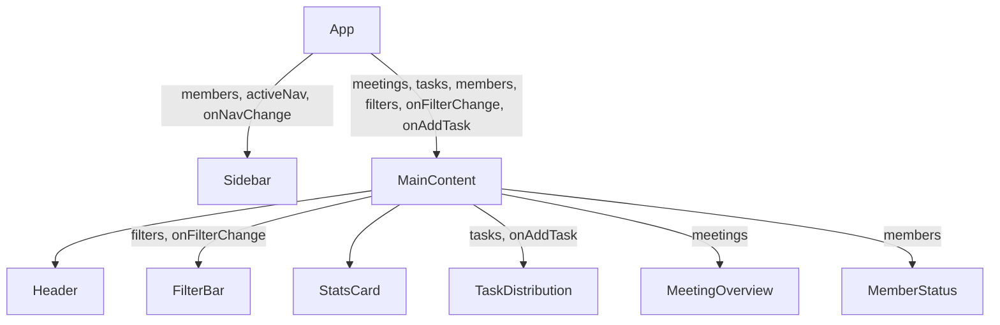

# Design Document: Managic Pro Dashboard (React Conversion)

## Overview

This document describes the technical design for converting the existing "Managic Pro" HTML dashboard into a React application. The goal is to preserve all existing UI functionality and visual fidelity while introducing a proper React component hierarchy, typed data structures, centralized state management, and interactive behaviors (filter selection, task addition).

The application is a single-page dashboard with no routing requirements. All state lives at the `App` level and flows down via props. No external data fetching is needed — all data is initialized from a single constants file.

---

## Architecture

The application follows a unidirectional data flow pattern:

```
App (state owner)
├── Sidebar (receives members, activeNav, onNavChange)
└── MainContent (receives meetings, tasks, members, filters, onFilterChange, onAddTask)
    ├── Header
    ├── FilterBar (receives filters, onFilterChange)
    ├── StatsCard
    ├── TaskDistribution (receives tasks, onAddTask)
    ├── MeetingOverview (receives meetings)
    └── MemberStatus (receives members)
```



State is owned exclusively by `App`. Child components are presentational — they receive data via props and emit events via callback props.

---

## Components and Interfaces

### App

The root component. Owns all application state and passes data/callbacks to children.

```ts
// State
activeNav: string          // currently selected nav link
selectedManager: string    // filter: selected manager value
selectedPeriod: string     // filter: selected time period value
tasks: Task[]              // list of priority tasks
meetings: Meeting[]        // list of meetings
members: Member[]          // list of team members
```

Callbacks defined in App:
- `handleNavChange(nav: string): void`
- `handleFilterChange(field: 'manager' | 'period', value: string): void`
- `handleAddTask(): void` — appends a new empty Task to `tasks`

---

### Sidebar

```ts
interface SidebarProps {
  members: Member[]
  activeNav: string
  onNavChange: (nav: string) => void
}
```

Renders:
- Navigation links (Dashboard, Activity Tracking, Board Members, Meetings)
- Team member list
- User account section (hardcoded: "AmirBaqian", "Product Manager")

---

### MainContent

```ts
interface MainContentProps {
  meetings: Meeting[]
  tasks: Task[]
  members: Member[]
  filters: { manager: string; period: string }
  onFilterChange: (field: 'manager' | 'period', value: string) => void
  onAddTask: () => void
}
```

Renders the header, FilterBar, StatsCard, TaskDistribution, MeetingOverview, and MemberStatus.

---

### FilterBar

```ts
interface FilterBarProps {
  filters: { manager: string; period: string }
  onFilterChange: (field: 'manager' | 'period', value: string) => void
}
```

Renders two `<select>` dropdowns and a "More Filters" button.

---

### StatsCard

```ts
interface StatsCardProps {
  label: string
  value: string | number
  supplementary: string
}
```

Stateless display component. Renders a metric card.

---

### TaskDistribution

```ts
interface TaskDistributionProps {
  tasks: Task[]
  onAddTask: () => void
}
```

Renders the Management > Tasks hierarchy and the priority task list. The "New Task" button calls `onAddTask`.

---

### MeetingOverview

```ts
interface MeetingOverviewProps {
  meetings: Meeting[]
}
```

Renders a table. When `meetings` is empty, renders a "No meetings available" message.

---

### MemberStatus

```ts
interface MemberStatusProps {
  members: Member[]
}
```

Renders one entry per member showing name, role, and current work.

---

## Data Models

All data is initialized from `src/data/constants.js` (or `.ts`).

### Task

```ts
interface Task {
  id: string           // unique identifier (e.g. uuid or index-based)
  name: string         // task name, e.g. "Logo Design"
  description: string  // short description, e.g. "Visual identity changes"
  priority: 'high' | 'medium' | 'low'
}
```

Initial data:
```js
export const INITIAL_TASKS = [
  { id: '1', name: 'Logo Design',    description: 'Visual identity changes',    priority: 'high' },
  { id: '2', name: 'Instagr Story',  description: 'Promotion campaign assets',  priority: 'medium' },
  { id: '3', name: 'Branding',       description: 'Update brand guidelines',    priority: 'low' },
]
```

When "New Task" is clicked, a new Task is appended with empty `name` and `description` and a generated `id`.

---

### Meeting

```ts
interface Meeting {
  id: string
  date: string      // e.g. "Mon, 12 Feb"
  time: string      // e.g. "10:00 AM"
  purpose: string
  manager: string
  outcomes: string
}
```

Initial data (3 pre-populated rows from original dashboard).

---

### Member

```ts
interface Member {
  id: string
  name: string
  role: 'Administrator' | 'Admin' | 'Member'
  currentWork: string
}
```

Initial data:
```js
export const INITIAL_MEMBERS = [
  { id: '1', name: 'Max Maraston',  role: 'Administrator', currentWork: '...' },
  { id: '2', name: 'Sasha Glinsky', role: 'Admin',         currentWork: '...' },
  { id: '3', name: 'Yana Snezin',   role: 'Member',        currentWork: '...' },
]
```

---

### Filter State

```ts
interface Filters {
  manager: string   // one of: 'All Managers' | 'Max Maraston' | 'Sasha Glinsky'
  period: string    // one of: 'This Week' | 'Last 30 Days' | 'This Quarter'
}
```

---

## Project Structure

```
src/
  data/
    constants.js        # INITIAL_TASKS, INITIAL_MEETINGS, INITIAL_MEMBERS, filter options
  components/
    Sidebar.jsx
    MainContent.jsx
    FilterBar.jsx
    StatsCard.jsx
    TaskDistribution.jsx
    MeetingOverview.jsx
    MemberStatus.jsx
  App.jsx
  index.jsx
  App.css             # global styles matching original color scheme
```


---

## Correctness Properties

*A property is a characteristic or behavior that should hold true across all valid executions of a system — essentially, a formal statement about what the system should do. Properties serve as the bridge between human-readable specifications and machine-verifiable correctness guarantees.*

### Property 1: Active nav link reflects selection

*For any* navigation link in the Sidebar, clicking that link should result in exactly that link having the active visual state, and no other link having the active state.

**Validates: Requirements 2.2**

---

### Property 2: Filter change callback receives correct value

*For any* filter field (`manager` or `period`) and any valid option value for that field, selecting that option in the FilterBar should invoke `onFilterChange` with exactly that field name and that value.

**Validates: Requirements 4.4, 4.5**

---

### Property 3: New Task grows the task list by one

*For any* current task list state in the App, clicking the "New Task" button should result in the TaskDistribution rendering exactly one more task entry than before, and the previously existing tasks should remain unchanged.

**Validates: Requirements 6.4, 9.3**

---

### Property 4: MeetingOverview renders one row per meeting

*For any* array of meetings passed to MeetingOverview, the number of rendered table rows (excluding the header) should equal the length of the meetings array.

**Validates: Requirements 7.2**

---

### Property 5: MemberStatus renders all member fields

*For any* array of members passed to MemberStatus, each member's name, role, and currentWork should all appear in the rendered output.

**Validates: Requirements 8.1, 8.2**

---

## Error Handling

- **Empty meetings list**: MeetingOverview renders a "No meetings available" message instead of an empty table (Requirement 7.4).
- **Empty tasks list**: TaskDistribution renders the "New Task" button even when the task list is empty, so the user can always add tasks.
- **Empty members list**: MemberStatus renders nothing (empty section) — no error state needed since members are always pre-populated.
- **New Task defaults**: When a new task is added, it is initialized with empty `name` and `description` strings and a generated unique `id` (e.g. `Date.now().toString()`). Priority defaults to `'low'`.
- **PropTypes / TypeScript**: All components validate their props. Missing required props will produce a console warning in development.

---

## Testing Strategy

### Dual Testing Approach

Both unit tests and property-based tests are required. They are complementary:
- Unit tests catch concrete bugs with specific known inputs.
- Property tests verify general correctness across a wide range of generated inputs.

### Unit Tests (Example-Based)

Focus on specific rendering checks and edge cases:

- **App renders Sidebar and MainContent** — verifies the full-page layout structure (Req 1.1)
- **Sidebar displays all nav links** — checks for "Dashboard", "Activity Tracking", "Board Members", "Meetings" (Req 2.1)
- **Sidebar displays member names and user account** — checks for all three member names, "AmirBaqian", "Product Manager" (Req 2.3, 2.4)
- **Header text** — checks for "Management Activity Tracking" and the subtitle (Req 3.1, 3.2)
- **FilterBar options** — checks all manager and period dropdown options are present, and "More Filters" button exists (Req 4.1, 4.2, 4.3)
- **StatsCard renders label, value, supplementary** — renders with props and checks all three values appear (Req 5.1, 5.2, 5.3)
- **TaskDistribution initial data** — renders with INITIAL_TASKS and checks all three task names appear (Req 6.1, 6.2, 6.3)
- **MeetingOverview column headers** — checks for "Date & Time", "Purpose", "Manager", "Outcomes" (Req 7.1)
- **MeetingOverview pre-populated rows** — renders with INITIAL_MEETINGS and checks 3 rows appear (Req 7.3)
- **MeetingOverview empty state** — renders with `[]` and checks for "no meetings" message (Req 7.4 — edge case)
- **MemberStatus pre-populated members** — renders with INITIAL_MEMBERS and checks all three names appear (Req 8.3)

### Property-Based Tests

Use a property-based testing library (e.g. **fast-check** for JavaScript/TypeScript). Configure each test to run a minimum of **100 iterations**.

Each test is tagged with a comment referencing the design property:
`// Feature: managic-pro-dashboard, Property {N}: {property_text}`

**Property 1 test** — Generate an array of nav link names. For each link, simulate a click and assert that only that link has the active state.
`// Feature: managic-pro-dashboard, Property 1: Active nav link reflects selection`

**Property 2 test** — Generate arbitrary `(field, value)` pairs from the valid options sets. Simulate selecting that option and assert `onFilterChange` was called with exactly `(field, value)`.
`// Feature: managic-pro-dashboard, Property 2: Filter change callback receives correct value`

**Property 3 test** — Generate an arbitrary array of tasks as initial state. Simulate clicking "New Task" and assert the rendered task count increased by exactly 1 and all original tasks are still present.
`// Feature: managic-pro-dashboard, Property 3: New Task grows the task list by one`

**Property 4 test** — Generate an arbitrary array of Meeting objects (including empty array). Render MeetingOverview and assert the row count equals the array length.
`// Feature: managic-pro-dashboard, Property 4: MeetingOverview renders one row per meeting`

**Property 5 test** — Generate an arbitrary array of Member objects. Render MemberStatus and assert each member's name, role, and currentWork all appear in the output.
`// Feature: managic-pro-dashboard, Property 5: MemberStatus renders all member fields`
